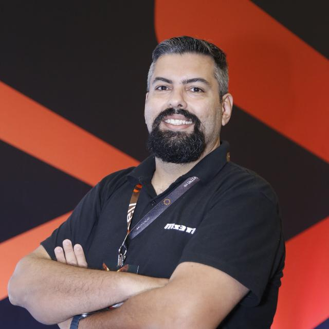
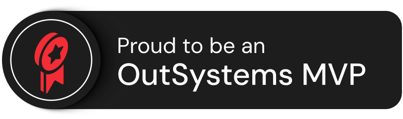
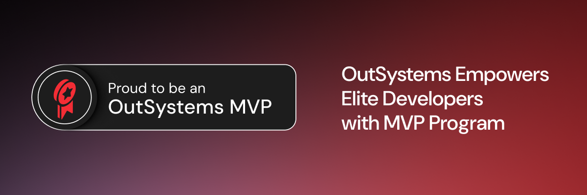

# Edson Marques

### 🚀 OutSystems MVP • Solutions Architect • Technical Leader • Low-code Specialist

    

Enterprise Software Architecture | OutSystems | Mendix | Technical Leadership | Training | Delivery Excellence

---

*"Technology is not only about coding. It is about solving problems, enabling people and delivering value."*

---

# 👨‍💻 About Me

Certified technology professional with **18+ years of experience** delivering enterprise solutions, software architecture, technical leadership and digital transformation initiatives.

Recognized as an **OutSystems MVP**, acting as **Solutions Architect**, **Technical Leader**, **Trainer** and consultant in enterprise environments.

Strong background in:

✅ Enterprise Architecture

✅ Low-code Transformation

✅ Team Leadership

✅ Technical Mentoring

✅ Delivery Governance

✅ Agile Processes

✅ Software Modernization

✅ Training & Enablement

---

# 🏆 OutSystems Journey

## MVP Recognition

🏅 **OutSystems MVP**

Recognized by the OutSystems community and ecosystem for technical contributions, enterprise expertise and leadership.

 

🌟 **OutSystems Champion**

Community recognition for contribution, mentoring, technical enablement, knowledge sharing and ecosystem engagement.

<table align="center">
<tr>
<td align="center">

MVP  
Enterprise Excellence

</td>

<td align="center">

Champion  
Community Impact

</td>
</tr>
</table>

---

## Main Certifications

### Architecture & Leadership

- OutSystems Architecture Specialist (O11)
- OutSystems Tech Lead
- OutSystems Certified Trainer
- OutSystems Pre-Sales
- OutSystems Sales

### Development

- OutSystems Expert Developer
- OutSystems Professional Web Developer
- OutSystems Professional Mobile Developer
- OutSystems Reactive Developer
- OutSystems Traditional Web Developer

### Platform & Operations

- OutSystems Platform Ops Engineer
- OutSystems DevOps Engineer
- OutSystems Security Specialist

### ODC

- OutSystems Associate Developer
- OutSystems Web Specialist
- OutSystems Front-end Specialist
- OutSystems Mobile Specialist

---

# 🚀 Technology Stack

## Low-code Platforms

---

## Architecture & Engineering

- Enterprise Architecture
- Solution Design
- Distributed Systems
- Legacy Modernization
- Integration Architecture
- DevOps
- Platform Operations
- Security
- Agile Delivery
- Software Governance

---

## Leadership

- Squad Leadership
- Technical Leadership
- Team Mentoring
- Delivery Management
- Technical Training
- Customer Enablement
- Technical Presentations
- Pre-sales Support

---

# 💼 Professional Experience

## CTO • Solutions Engineer • Co-Founder

**Digitale Systems**

Leading technology initiatives, product strategy, architecture decisions and innovation.

---

## Petrobras Technical Representative

Enterprise project governance, team leadership, delivery coordination and operational management.

---

## Senior Solutions Architect

**True Change Tecnologia**

Architecture, mentoring, innovation and enterprise OutSystems best practices.

---

## Consultant • Technical Lead • Trainer

Training teams and squads in:

- Architecture
- Best Practices
- Delivery Processes
- Low-code Development Lifecycle
- Technical Governance

---

# 🌎 International Profile

🇧🇷 Brazilian Citizen

🇵🇹 Portuguese Citizen

🌍 Based in São Paulo, Brazil

🗣 Languages:

- Portuguese — Native
- English — B2
- Spanish — B2

---

# 🚀 Featured Projects

## OutSystems Certification Simulators

Training material and mock exams for certification preparation.

---

## Enterprise Low-code Consulting

Architecture reviews, mentoring, delivery optimization and enablement.

---

## AI + Low-code Research Lab

Experiments integrating AI with low-code ecosystems.

---

## MS3TI GlobalImage

Workstation cloning and deployment solution.

---

# 📈 GitHub Analytics

---

# 🔥 Contribution Activity

---

# 🏆 GitHub Trophies

---

# 🎯 Current Interests

🔹 Enterprise Low-code

🔹 Solution Architecture

🔹 AI + Low-code

🔹 Team Enablement

🔹 Delivery Excellence

🔹 Technical Training

🔹 Digital Transformation

---

# 🌐 Connect With Me

🌍 Links:

https://linktr.ee/engedsonmarques

🌍 Website:

https://www.ms3ti.com.br

📧 Email:

edson.marques@ms3ti.com.br

💼 LinkedIn:

https://linkedin.com/in/edsonmarques

📸 Instagram:

[@engedsonmarques](https://www.instagram.com/engedsonmarques)

---

  

### ⚡ Building scalable solutions, enabling teams and transforming ideas into enterprise systems.

